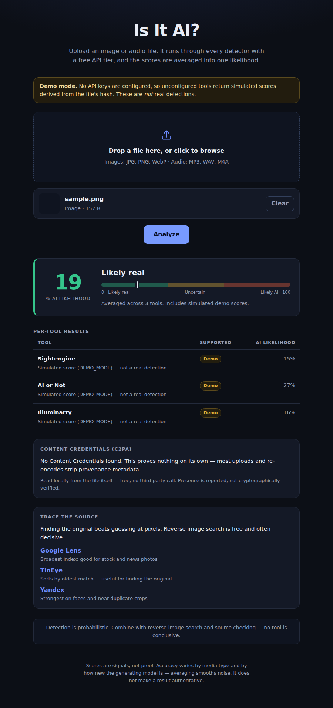

# Is It AI?

Upload an **image** or **audio** file, run it through the AI-detection tools that have a real free API tier, then compare the results and show an **averaged likelihood** that the file is AI-generated.



## What it does

1. You upload an image (`.jpg`, `.png`, `.webp`) or audio file (`.mp3`, `.wav`, `.m4a`).
2. The server fans out to every configured detector that supports that media type, in parallel.
3. Each detector's response is normalized to a 0–100 AI probability.
4. You get each tool's individual score, an average across the tools that answered, and a plain verdict.

It also does two things for free, with no API key at all: a **Content Credentials (C2PA)** check read straight out of the file, and **reverse image search** link-outs for tracing the original.

## Quick start

```bash
npm install
cp .env.example .env      # add whatever keys you have
npm start                 # http://localhost:3000
```

No keys yet? Run it in demo mode to see the whole interface working:

```bash
DEMO_MODE=true npm start
```

Demo mode fills unconfigured tools with a score derived from the file's own hash — stable per file, and labelled as simulated everywhere it appears. It is not a detection. Do not leave it on in production.

```bash
npm test                  # 35 tests, no network access needed
```

## Detectors

| Tool | Media | Free tier | Keys |
|---|---|---|---|
| [Sightengine](https://sightengine.com/docs/ai-generated-image-detection) | Image | ~2,000 ops/month | `SIGHTENGINE_API_USER`, `SIGHTENGINE_API_SECRET` |
| [AI or Not](https://docs.aiornot.com) | Image, audio | Free tier + paid | `AIORNOT_API_KEY` |
| [Illuminarty](https://illuminarty.ai/en/api-docs) | Image | Free tier | `ILLUMINARTY_API_KEY` |

Every detector is optional. The app runs with whatever is configured and reports the rest as unconfigured rather than failing.

**Audio coverage is thin.** Of the free options, AI or Not is the only one that handles audio, so an audio "average" usually comes from a single tool. The UI says so on the result rather than presenting one opinion as a consensus.

Hive and Reality Defender are strong but effectively paid/enterprise, so they are out of the free build. Adding one is a new file in `server/detectors/` plus a line in the registry.

## Architecture

```
[ Browser ]  ──upload──►  [ Express server ]  ──►  Sightengine
   public/                  holds API keys     ──►  AI or Not
                                               ──►  Illuminarty
      ◄──── averaged + per-tool results ──────────┘
```

The backend exists for two reasons the spec calls out: detection APIs will not accept cross-origin calls straight from frontend JavaScript, and API keys must never ship to the browser. Keys are read from environment variables server-side and are not included in `/api/config`.

```
server/
  index.js              Express app, routes, upload limits
  detectors/
    index.js            registry + parallel fan-out + demo mode
    shared.js           multipart upload, timeouts, HTTP error classification
    sightengine.js      one adapter per tool: call it, dig out its probability
    aiornot.js
    illuminarty.js
  lib/
    scoring.js          normalize → average → verdict band
    media.js            image/audio detection from magic bytes, MIME, extension
    c2pa.js             Content Credentials presence check (local, no deps)
    links.js            reverse image search targets
public/                 frontend: no build step, no framework
test/                   unit + end-to-end tests
```

Uploads are held in memory and forwarded straight to the detectors — nothing is written to disk, and the buffer is released with the response.

## Scoring

Each adapter digs the raw probability out of its own response shape, then:

```
score_percent = round(raw_probability * 100)     # 0..1 floats and 0..100 ints both handled
average       = mean(scores from tools that answered)
```

**Tools that fail or don't support the file are skipped, not counted as zero.** An image-only tool must not drag an audio file's average toward "real". If nothing scores, the average is `null` and the UI says why rather than showing a number.

| Average | Verdict |
|---|---|
| 0–35% | Likely real |
| 36–65% | Uncertain |
| 66–100% | Likely AI-generated |

## Error handling

Every tool is isolated: one failing never fails the batch, and the reason reaches the results table in plain language. HTTP statuses are classified into what you actually need to know — `auth` (bad key), `quota` (free tier exhausted), `rate_limit` (throttled, retry), `timeout`, `unsupported`, `parse` (response shape changed), `upstream`. Each detector call has its own timeout (`DETECTOR_TIMEOUT_MS`, default 30s), so a hanging provider cannot stall the request.

Sightengine reports some failures with HTTP 200 and `status: "failure"`, so that body is checked too.

## Content Credentials

`server/lib/c2pa.js` walks the PNG/JPEG/WebP container for an embedded C2PA manifest and reads the claim generator when it can. Free, local, dependency-free.

This is a **presence** check, not cryptographic verification — that needs the full `c2pa` toolkit. It is a strong signal in one direction only: a manifest naming an AI generator is direct provenance, better than any detector score. Absence proves nothing, since most uploads and re-encodes strip metadata.

## API

**`GET /api/config`** — the detector list with support and configuration state, accepted types, upload limit. No secrets.

**`POST /api/analyze`** — multipart, one file under `file`.

```json
{
  "file": { "name": "photo.jpg", "kind": "image", "format": "jpeg", "sizeLabel": "1.2 MB" },
  "perTool": [
    { "id": "sightengine", "name": "Sightengine", "status": "ok", "score": 92 },
    { "id": "aiornot", "name": "AI or Not", "status": "error", "score": null,
      "errorCode": "quota", "message": "Free-tier quota exhausted for this tool." },
    { "id": "illuminarty", "name": "Illuminarty", "status": "ok", "score": 78 }
  ],
  "average": 85,
  "verdict": "Likely AI-generated",
  "level": "ai",
  "contributingTools": 2,
  "singleSource": false,
  "contentCredentials": { "present": false, "generator": null, "aiGeneratorDetected": false, "note": "…" },
  "reverseSearch": [ { "name": "Google Lens", "url": "…", "note": "…" } ],
  "disclaimer": "Detection is probabilistic. …"
}
```

Status codes: `400` no file, `413` over the size limit, `415` unsupported type.

## A note on the results

Detection is probabilistic. Accuracy varies a lot by media type and by how new the generating model is, and averaging smooths noise without making any result authoritative. Treat a score as one signal, alongside reverse image search and ordinary source checking.

## Configuration

| Variable | Default | Purpose |
|---|---|---|
| `PORT` | `3000` | HTTP port |
| `MAX_UPLOAD_MB` | `25` | Upload size limit |
| `DETECTOR_TIMEOUT_MS` | `30000` | Per-detector timeout |
| `DEMO_MODE` | `false` | Simulated scores for unconfigured tools |

Provider endpoints and multipart field names are also overridable (`SIGHTENGINE_API_URL`, `AIORNOT_IMAGE_URL`, `AIORNOT_AUDIO_URL`, `AIORNOT_FILE_FIELD`, `ILLUMINARTY_API_URL`, `ILLUMINARTY_FILE_FIELD`) — these APIs move their endpoints and rename fields, and that shouldn't need a code change. Confirm each against the provider's current docs before relying on it.

Requires Node 18.17+ (uses the built-in `fetch`, `FormData`, and `Blob`). Runtime dependencies: `express`, `multer`, `dotenv`.
